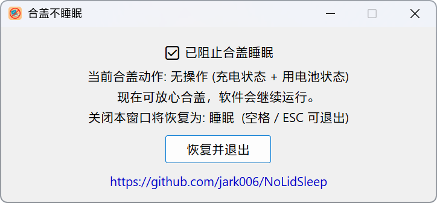

# NoLidSleep

### 🛏️ 合盖不睡眠

中文 | <a href="README_EN.md">English</a>

**盖盖不睡眠，Agent 接着干。**

*Claude Code、Codex……关上盖子照样跑*

---

## ✨ 功能特点

- 🚫 **阻止合盖睡眠** — 将合盖动作设为"不操作"，交流电和电池均生效
- 🔒 **阻止空闲睡眠** — 调用 `SetThreadExecutionState` 防止系统自动休眠
- 🔄 **退出自动恢复** — 关闭程序时自动恢复合盖睡眠设置
- 🌍 **20 种语言** — 自动匹配系统语言，无需手动选择
- 📐 **自适应界面** — 文字自动换行，窗口高度、按钮宽度随语言自适应
- 🖥️ **DPI 适配** — 支持高分辨率和多显示器缩放
- 🪶 **轻量无依赖** — 单个 exe，无运行时依赖，无需安装

## 🚀 使用方法

1. 从 [Releases](https://github.com/jark006/NoLidSleep/releases) 下载最新版本
2. 双击运行 `NoLidSleep.exe`
3. 合上笔记本盖子，程序继续运行 🎉
4. 需要恢复时，点击"恢复并退出"或按 `ESC` / `空格` 退出

## 🌍 支持语言

简体中文, 繁體中文, English, 日本語, 한국어, Deutsch, Français, Español, Português, Русский, Italiano, Nederlands, Polski, Türkçe, ภาษาไทย, Tiếng Việt, Svenska, Čeština, Magyar, Dansk

## 📜 许可证

[MIT License](LICENSE)

Made with ❤️ by [jark006](https://github.com/jark006)

