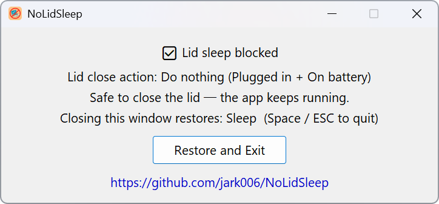

# NoLidSleep

### 🛏️ Keep Your Laptop Awake When the Lid is Closed

<a href="README.md">中文</a> | English

**Shut the lid. Agents keep coding.**

*Let Claude Code, Codex, and any CLI agent run safely in the background — even with the lid closed.*

---

## ✨ Features

- 🚫 **Block lid sleep** — Sets the lid close action to "Do nothing" for both AC and battery
- 🔒 **Block idle sleep** — Calls `SetThreadExecutionState` to prevent automatic system sleep
- 🔄 **Auto-restore on exit** — Restores original lid sleep settings when the app closes
- 🌍 **20 languages** — Automatically matches your system language, no manual selection needed
- 📐 **Adaptive UI** — Text auto-wraps; window height and button width adapt to the current language
- 🖥️ **DPI-aware** — Supports high-resolution displays and multi-monitor scaling
- 🪶 **Lightweight & portable** — Single exe, no runtime dependencies, no installation required

## 🚀 Usage

1. Download the latest release from [Releases](https://github.com/jark006/NoLidSleep/releases)
2. Double-click `NoLidSleep.exe` to run
3. Close your laptop lid — the app keeps running 🎉
4. When you want to restore, click "Restore and Exit" or press `ESC` / `Space`

## 🌍 Supported Languages

简体中文, 繁體中文, English, 日本語, 한국어, Deutsch, Français, Español, Português, Русский, Italiano, Nederlands, Polski, Türkçe, ภาษาไทย, Tiếng Việt, Svenska, Čeština, Magyar, Dansk

## 📢 Friends Links: LINUX DO

[LINUX DO](https://linux.do)

Everyone there is super talented and speaks so nicely—I absolutely love this place.

## 📜 License

[MIT License](LICENSE)

Made with ❤️ by [jark006](https://github.com/jark006)

